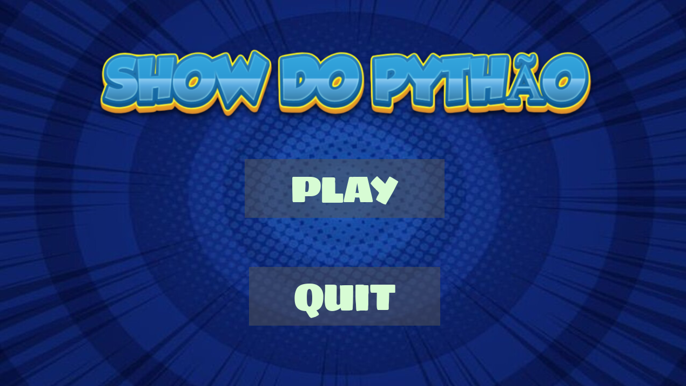
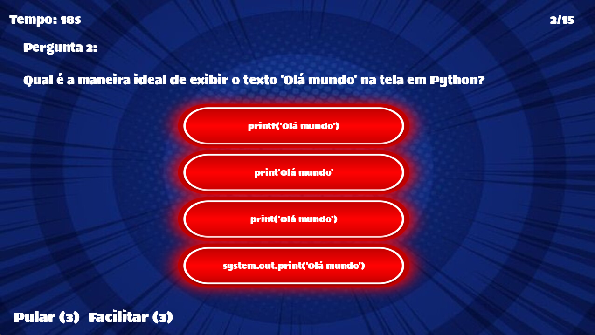
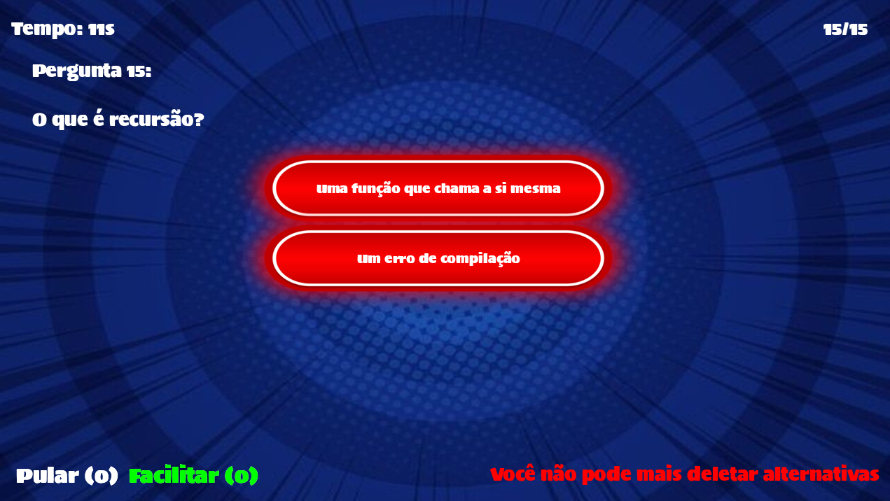

# Show do Pythão

Projeto feito para disciplina "Algoritimos e Lógica de Programação" em equipe. Show do Pythão é um jogo de perguntas e respostas inspirado no famoso programa de TV "Show do Milhão". Foi desenvolvido em Python com a biblioteca Pygame, e o jogo oferece uma experiência interativa e divertida, onde você pode testar seus conhecimentos em python!

---

## 🎮 Sobre o Jogo

O objetivo do jogo é responder corretamente a uma série de perguntas de múltipla escolha. Cada pergunta acertada aumenta sua pontuação, e você pode ganhar até **R$ 1.000.000,00** se chegar à última pergunta! O jogo inclui recursos como:

- **Pulos**: Você pode pular até 3 perguntas.
- **Facilitador**: Remove duas alternativas erradas (pode ser usado até 3 vezes).
- **Temporizador**: Cada pergunta tem um tempo limite para resposta de 20 segundos.
- **Sistema de Contagem**: Conta em que pergunta você está. Ex: (1/15)

---

## 🎯 Funcionalidades
- **Menu Inicial**: Escolha entre jogar, ver a classificação ou sair do jogo.
- **Sons e Efeitos**: Efeitos sonoros e músicas para imersão no jogo.
- **Tela de Vitória/Derrota**: Exibe a pontuação final e permite reiniciar o jogo.

## 🛠️ Tecnologias Utilizadas
- **Python**: Linguagem de programação principal.
- **Pygame**: Biblioteca para desenvolvimento de jogos.
- **Git**: Controle de versão do projeto.

## Demonstração e Imagens
# Tela Inicial

# Perguntas

# Facilitar

# Tela Vitória

# Tela Derrota

